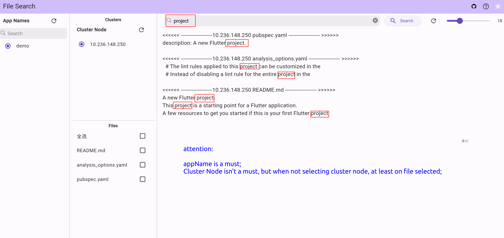
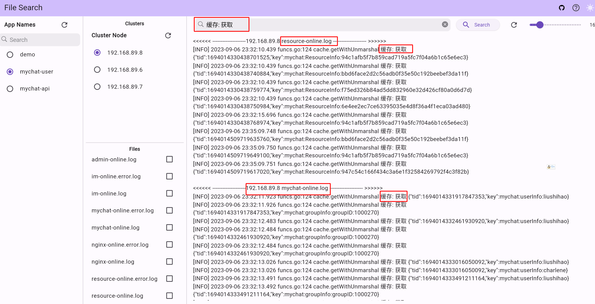
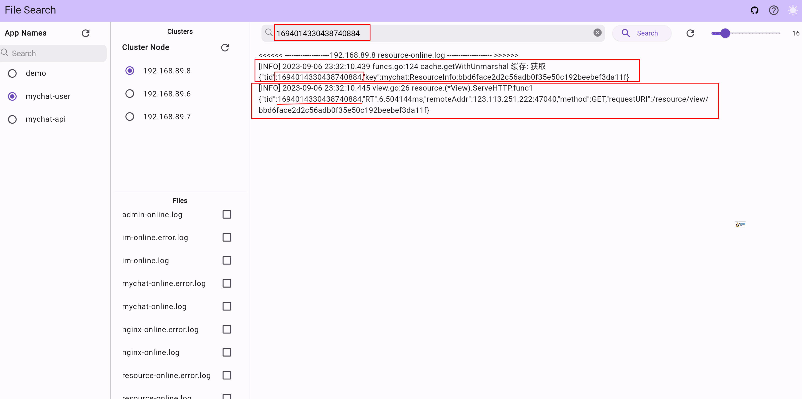

# fsearch

Search text in files quickly(using linux grep command), especially for log searching. Directories are supported.
Support local remote online registration search and single machine search.

## Quick Start
- Look at the example directory for more details.
### Server
- go to the release page to download the `web.zip` file
  - https://github.com/vito-go/fsearch_flutter/releases/
- unzip the `web.zip` file
 

```go
package main

import (
	"github.com/vito-go/fsearch"
	"log"
	"net/http"
)

// uncomment this if you want to use embed file
/*
//go:embed web
var staticEmbededFile embed.FS
*/
func main() {
	authMap := map[string]*fsearch.AccountConfig{
		// you can add more account here		
	}
	// authMap can be nil if you don't need auth
	server := fsearch.NewServer( "/", "/wsRegister", authMap)
	log.Println("server start: 9097")
	// the dir is that you download and unzip above 
	staticWebFile := http.Dir("web")
	// you can also use embed file here, but you need to uncomment the code above and import embed
	// e.g staticWebFile := http.FS(staticEmbededFile)
	err:=server.StartListenAndServe(staticWebFile, ":9097")
    if err != nil{
      panic(err)
    }
}

```

### Client

```go


package main

import (
	"github.com/vito-go/fsearch"
	"github.com/vito-go/fsearch/util"
)

func main() {
	appName := "demoApp"
	searchDir := "github.com/vito-go/fsearch" // can be any directory, especially for logs/ 
	cli, err := fsearch.NewClient(searchDir, appName)
	if err != nil {
		panic(err)
	}
	cli.RegisterToCenter("ws://127.0.0.1:9097/wsRegister")
	// write here your own code instead of select {}
	select {}
}

```

## Demo



`

## TODO
- [ ] Add more search options