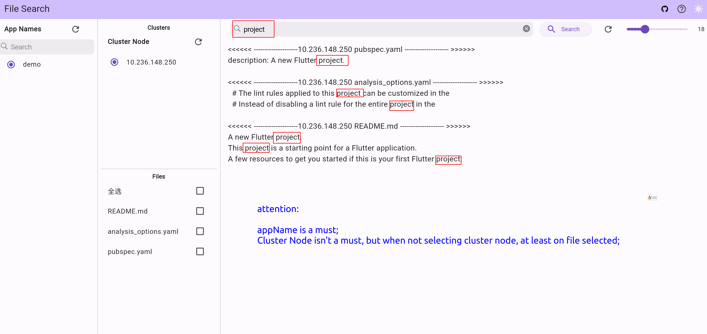
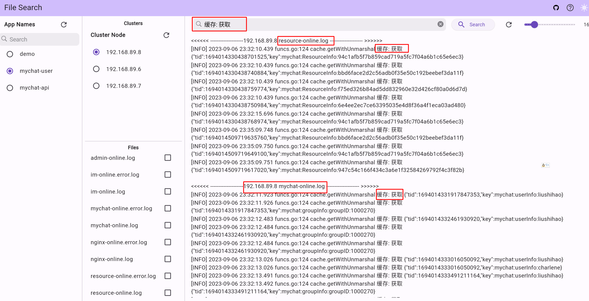
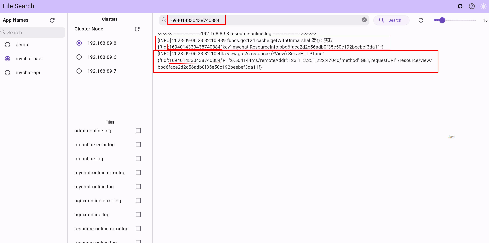

# fsearch

Search text in files quickly(using linux mmap), especially for log searching. Directories are supported.
Support local remote online registration search.
## Quick Start

### Server

```shell
	wget https://github.com/vito-go/fsearch_flutter/releases/download/v0.0.1/web.zip
	unzip web.zip

```

```go
package main

import (
	"github.com/vito-go/fsearch/unilog"
	"log"
	"net/http"
	"os"
	"path/filepath"
)

func main() {
	homeDir, err := os.UserHomeDir()
	if err != nil {
		panic(err)
	}
	server := unilog.NewServer("/search", "/", "/ws")
	log.Println("server start: 9097")
	// the dir is that you download and unzip above 
	staticWebFile := http.Dir(filepath.Join(homeDir, "go/src/github.com/vito-go/fsearch_flutter/build/web"))
	server.StartListenAndServe(staticWebFile,":9097")
}

```

### Client

```go


package main

import (
	"github.com/vito-go/fsearch/unilog"
	"github.com/vito-go/fsearch/util"
	"os"
	"path/filepath"
)

func main() {
	homeDir, err := os.UserHomeDir()
	if err != nil {
		panic(err)
	}
	appName := "demoApp"
	searchDir := "github.com/vito-go/fsearch" // can be any directory, especially for logs/ 
	hostName, _ := util.GetPrivateIP()        //hostName can be any flag
	cli, err := unilog.NewClient(filepath.Join(homeDir, searchDir), appName, hostName)
	if err != nil {
		panic(err)
	}
	cli.RegisterToCenter("ws://127.0.0.1:9097/ws")
	//cli.RegisterToCenter("ws://vitogo.tpddns.cn:9097/ws")
 	// write here your own code instead of select {}
	select {}
}

```

## Demo






## TODO
- auth for each app
## FIXME 
- it will panic when file was deleted
